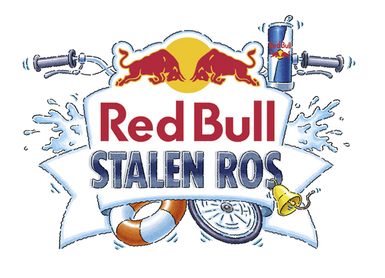
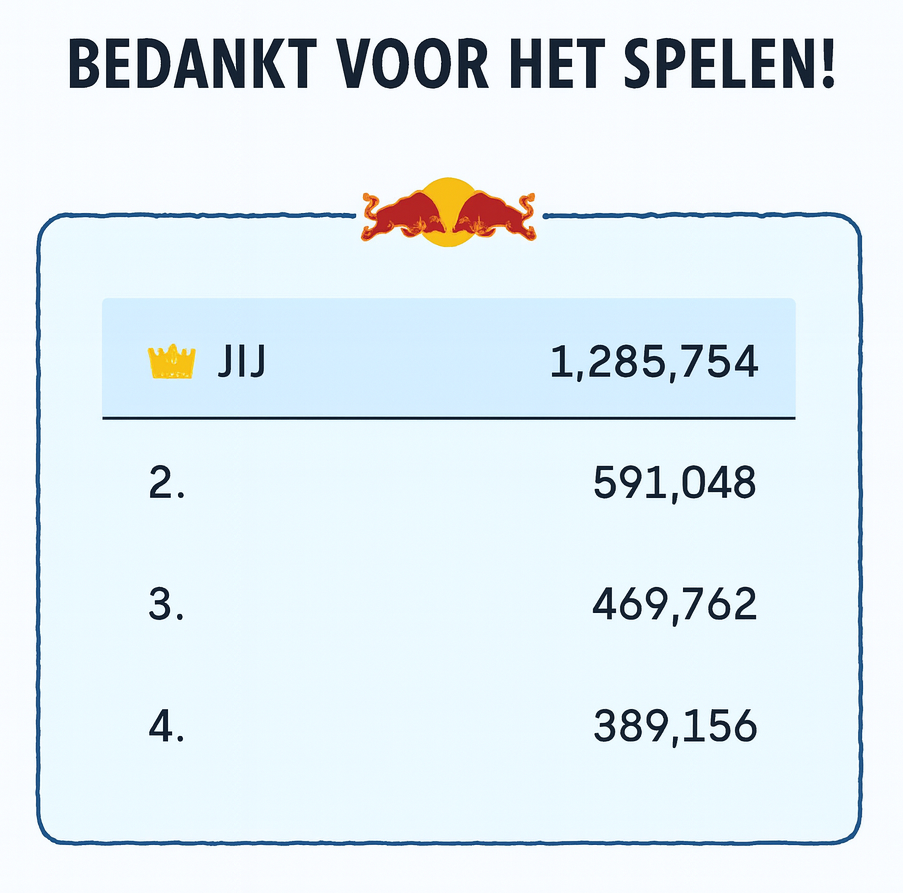
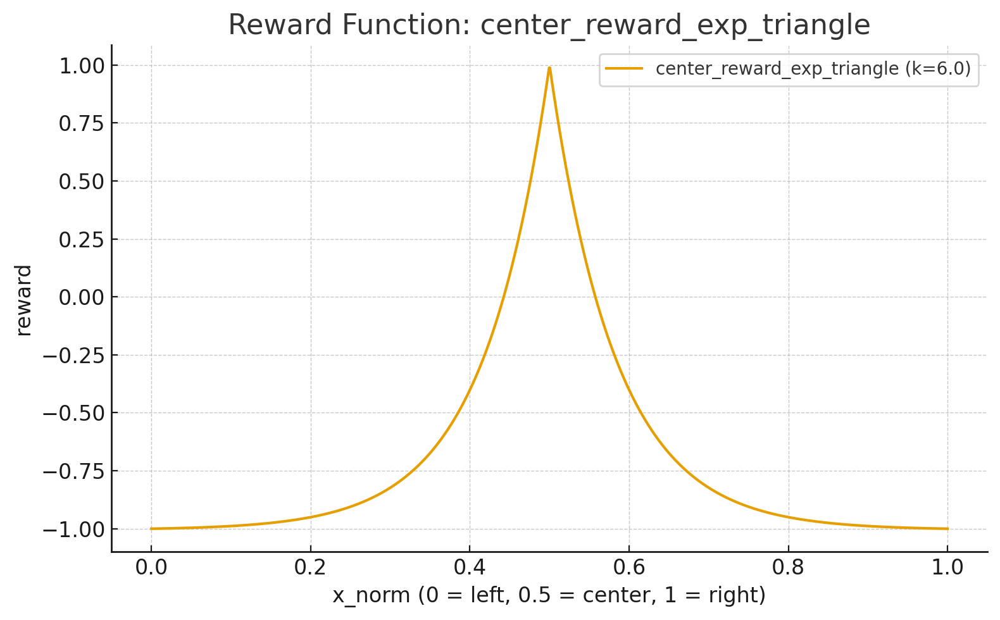

# Reinforcement Learning to play a browser game
**Deep Q Reinforcement Learning (Rainbow) + Playwright browser automation**  
→ trains an agent to play and win the official Red Bull Stalen Ros browser game.  

<p align="center">
  
  
  
</p>


Red Bull Stalen Ros is a unique cycling event where competitors ride homemade steel tandem bikes across a narrow, elevated track suspended over water. The event took place in The Hague, attracting an enthusiastic audience of 10,000 spectators who watched 33 duos navigate the 80-meter-long track. The goal is to maintain balance and successfully cross the track without falling in. The event encourages creativity and fun, making it a thrilling spectacle for participants and viewers alike. 

> *“Too lazy to build the bike, but still wanted to join the madness…”* 🚲🔥  

I missed the sign-up for the **Red Bull Stalen Ros 2025** event — but luckily, Red Bull released a browser-based game to win a chance at participating with a sponsored bike.  

> *"Registered too late for Red Bull Stalen Ros? No stress. From August 11 to September 5, you still get the chance to ride the track. Registration may be closed, but we’re arranging a unique experience that lets you get on the bike anyway. We’re building one special bike. And it’s for you + 1. Is that you? 🤯🚲"*  

Since I wasn’t about to start welding a tandem in my living room, I decided to go digital. This project trains a reinforcement learning agent to **play the online version of Stalen Ros** and balance the in-game gauge better than I ever could in real life.  

How the game works (officially):  
- Tap left/right on mobile or press arrow keys on PC to keep balance.  
- Stay in the green zone to rack up meters.  
- Leave your score and info → you might win a chance to ride the real **special tandem bike** on the Red Bull track.  

How this repo works (unofficially 😉):  
- An RL agent does the tapping for me.  
- It learns to keep the gauge centered using **Playwright** (browser automation) + **OpenCV** (guage tracking).  
- Trains a **Rainbow-lite DQN** with an MLP architecture instead of vision since I extract the guage's position using OpenCV

---

## 🏆 Leaderboard Result

The agent worked a little *too well*… I managed to get **1st place** on the leaderboard — with **double the score** of the 2nd place player.  




## Highlights

- **Hands-free play**: Navigates to the game, accepts cookies, clicks “**Volgende**”, captures the `<canvas>`, and plays.
- **Robust browser automation**: Headless/headed Chromium via Playwright, CSP bypass, HTTPS ignore, and bounded retries.
- **Stable vision**: OpenCV guage/dot detection with ROI cropping, denoising, CLAHE, and guardrails for empty frames.
- **Efficient RL**: Rainbow-lite (Dueling, Double Q, C51, NoisyNets, n-step, PER) tailored for small models.
- **Two observation modes**:
  - **Vector**: Extracts normalized x-position and simple dynamics (`x`, `dx_before`, `dx_after`) → **MLP** (fastest).
  - **Image**: 84×84 grayscale stacks → **tiny CNN** (compatible with DQN baselines).
- **Developer UX**: Rich logging, safe teardown, optional preview windows, and TensorBoard metrics.
- **Replay-aware**: Detects leaderboard/score to end episodes and supports “replay” buttons for quick resets.

---

## How it works (in 60 seconds)

1. **Open the game** with Playwright and click through cookie + intro buttons until the `<canvas>` is visible.  
2. **Capture frames** by screenshotting the canvas clip region; crop to a thin horizontal band where the gauge lives.  
3. **Detect gauge position** using `detect_dot_x_norm(...)`:
   - Convert ROI to HSV and threshold V for a **dark dot on bright background**.
   - Clean with morphology; choose the **largest valid blob**.
   - Compute **x_norm ∈ [0,1]** (0=left, 0.5=center, 1=right).
4. **Build observations**:
   - **Vector** mode: `x`, `dx_before`, `dx_after` (history-stacked) → **MLP (DQNMLP)**.
   - **Image** mode: 84×84 grayscale stacks → **tiny CNN (DQN)**.
5. **Act** with discrete taps: `NOOP`, `Left×{1..3}`, `Right×{1..3}`.
6. **Reward**: Center-shaped (exponential triangle): **+1 at center**, decays toward 0/−1 near bounds; early terminate if out-of-range or a **score** appears.
7. **Train** via Rainbow-lite with Prioritized Replay; checkpoint and log to TensorBoard.

Why vector MLP first?  
Because once the dot is reliably detected, an **MLP on 3 features** is dramatically faster and more stable than a vision encoder, while preserving the Rainbow benefits (dueling, distributional C51, noisy exploration).

---


## RL Environment

The reinforcement learning environment (`BrowserGameEnv`) wraps the browser game with a clean Gym-like API.

### Reward Function

The agent is rewarded for keeping the gauge dot **close to the center (x=0.5)**.  
We use an **exponential triangle reward**:

- **+1** when perfectly centered.  
- Decays smoothly toward **0** as the dot drifts outward.  
- Penalizes strongly (**≈ −1**) near the edges or if the gauge falls out of bounds.  
- Episode ends when out-of-bounds or a leaderboard score appears.

See the curve below:



This shaping encourages the agent to prefer stability around the center rather than just avoiding failure.

---

### Inputs (Observations)

Two observation modes are supported:

1. **Vector features (default, fastest)**  
   - Extracted from OpenCV dot detection:  
     - `x` → normalized gauge position ∈ [0,1]  
     - `dx_before` → delta before action  
     - `dx_after` → delta after action  
   - History of these vectors is stacked (default: 3 frames).  
   - Fed into a **Dueling MLP (DQNMLP)**.

2. **Image observations (slower, baseline)**  
   - Captures an 84×84 grayscale crop of the gauge.  
   - Stacked over time (default: 3 or 4).  
   - Fed into a **tiny CNN (DQN)**.

---

### Action Space

Discrete actions map to **arrow key taps**:

| ID | Action         | Effect              |
|----|----------------|---------------------|
| 0  | `NOOP`         | Do nothing          |
| 1  | `x1ArrowLeft`  | Tap Left once       |
| 2  | `x2ArrowLeft`  | Tap Left twice      |
| 3  | `x3ArrowLeft`  | Tap Left thrice     |
| 4  | `x1ArrowRight` | Tap Right once      |
| 5  | `x2ArrowRight` | Tap Right twice     |
| 6  | `x3ArrowRight` | Tap Right thrice    |

The tap timing (`key_hold_ms`, `inter_tap_ms`) is configurable in the `.env`.

This small discrete action space keeps learning tractable while still allowing variable-strength corrections.


## Demo commands

```bash
# 1) Sanity check: navigate, click "Volgende", and save a canvas screenshot
python -m src.scripts.utils.display_game_canvas

# 2) Sanity check: plot the reward function to visualize it
python -m src.scripts.utils.plot_reward_function

# 3) Train the agent (Rainbow-lite)
python -m src.scripts.train_agent

# 4) Launch Tensorboard to monitor training
tensorboard --logdir results/browser-redbull-game/tb

# 5) Run a trained agent
python -m src.scripts.run_agent


```

> The scripts read configuration from `.env`. See **Configuration** below.

---

## Installation

```bash
git clone https://github.com/Pieter-Cawood/RL-for-browser-game.git
cd RL-for-browser-game

python -m venv .venv
# Linux / macOS
source .venv/bin/activate
# Windows (PowerShell)
.venv\Scripts\Activate.ps1

pip install -r requirements.txt
python -m playwright install chromium

# Install package in editable mode (enables `python -m src.scripts.*`)
pip install -e .
```

---

## Configuration

All settings live in `.env`. Key ones you’ll likely touch:

### Browser & Page

```dotenv
GAME_URL=https://www.redbull.com/nl-nl/events/red-bull-stalen-ros-nederland/red-bull-stalen-ros-2025-speel-de-game
CANVAS_SELECTOR=#game-area canvas

# Intro/replay click sequences (ordered). Each item: {"type":"css"|"role"|"text","value":"...", "idx"?: int}
INTRO_BUTTONS=[{"type":"css","value":"#onetrust-accept-btn-handler"},{"type":"role","value":"Volgende"},{"type":"css","value":"cosmos-button-9-10-0"},{"type":"css","value":"#next-button"}]
REPLAY_BUTTONS=[{"type":"css","value":"cosmos-button-9-10-0","idx":1},{"type":"css","value":"#next-button"}]

# Cropping (percent-based) – keep only the horizontal band with the gauge
CROP_BOTTOM_OFFSET_PERCENT=12
CROP_HEIGHT_PERCENT=2
CROP_LEFT_PERCENT=27
CROP_RIGHT_PERCENT=27

# Click robustness
CLICK_RETRIES=15
CLICK_BACKOFF_MS=300
BUTTON_STABILITY_MS=200
REACTION_MOVEMENT_TIME_MS=50

# Browser behaviour
HEADLESS=false
SLOW_MO_MS=0
```

### RL (Rainbow-lite)

```dotenv
# Run ID / device
RAINBOW_ID=browser-redbull-game
SEED=123
DISABLE_CUDA=false

# Observation history / network size
HISTORY_LENGTH=3
HIDDEN_SIZE=128
NOISY_STD=0.1

# Distributional DQN (C51)
ATOMS=51
V_MIN=-1.0
V_MAX=1.0

# Training schedule
MEMORY_CAPACITY=100000
REPLAY_FREQUENCY=1
PRIORITY_EXPONENT=0.5
PRIORITY_WEIGHT=0.4
MULTI_STEP=1
DISCOUNT=0.995
TARGET_UPDATE=1000
LEARNING_RATE=0.0005
ADAM_EPS=0.00015
BATCH_SIZE=64
NORM_CLIP=10

LEARN_START=1000
LEARN_END=100000

# Checkpointing / TB
CHECKPOINT_INTERVAL=1000
TB_DIR=
TB_IMAGE_INTERVAL=0

# (Optional) Warm start / inference
MODEL_TRAIN=
MODEL_TEST=results/browser-redbull-game/checkpoint.pth

# Agent runtime
HEADLESS=true
MAX_STEPS=1000000
```

> Tip: start **headed** (`HEADLESS=false`) to verify clicks/canvas; once stable, switch to **headless**.

---

## Scripts & entry points

- `src/app/rainbow_rl/env.py BrowserGameEnv`: Playwright + OpenCV **environment** with:
  - Safe session lifecycle, replay clicks, gray-scale preview HUD, and optional agent animation window.
  - Actions: `0=NOOP`, `1..3=Left×{1..3}`, `4..6=Right×{1..3}`.
- `src/app/rainbow_rl/*`: Rainbow-lite agent, target network, prioritized replay, n-step, etc.
- `src/scripts/train_agent.py`: Environment-driven training loop (TensorBoard, checkpoints, optional memory save/load).
- `src/scripts/run_agent.py`: Greedy play with a trained checkpoint.
- `src/scripts/tests/display_game_canvas.py`: Browser navigation + canvas capture smoke test.

---

## Models

### Vector MLP (default for speed)

```python
# DQNMLP (dueling C51 with NoisyLinear)
in_dim = HISTORY_LENGTH * feature_dim   # e.g., 3 * 3 = 9 for [x, dx_before, dx_after] × 3
hidden ≈ 64–128 (configurable)
head   = dueling value/advantage → C51 atoms → softmax over atoms
```

**When to use**: Your dot detection is reliable and you want **max FPS** and fast learning.

### Tiny CNN (image stacks)

```python
# DQN (tiny CNN)
Conv(5×5, s=2) → Conv(3×3, s=2) → Conv(3×3, s=2) → GAP → Dueling C51 head
```

**When to use**: You want an end-to-end vision baseline or to avoid feature engineering.

---

## Quickstart

```bash
# 1) Verify canvas & clicks
python -m src.scripts.utils.display_game_canvas

# 2) Train from scratch
python -m src.scripts.train_agent

# 3) Run a trained model (MODEL_TEST in .env)
python -m src.scripts.run_agent

# 4) Monitor training
tensorboard --logdir results/browser-redbull-game/tb
```

---

## Troubleshooting

- **Canvas not found**  
  Check `CANVAS_SELECTOR`, ensure game is visible (disable ad-blockers), and try headed mode (`HEADLESS=false`).

- **Intro clicks failing**  
  Increase `CLICK_RETRIES`, `CLICK_BACKOFF_MS`. Validate `INTRO_BUTTONS` selectors (CSS vs role vs text). Some buttons are dynamic; the `"idx"` field can target the second instance.

- **No dot detected / jitter**  
  Tweak `CROP_*_PERCENT` to tighten the ROI over the gauge. Consider adjusting `v_thresh` and `min_blob_area_frac` in `detect_dot_x_norm`.

- **OpenCV windows crash in headless**  
  Set `display_input_window=false` and `display_agent_playing=false` (env/constructor). The code guards window creation, but CI systems may still object.

- **Performance is low**  
  Prefer **vector observations** (MLP). Reduce history length, set `HEADLESS=true`, and avoid preview windows.

---

## Project structure

```
src/
  app/
    browser_automation/
      __init__.py
      canvas.py                # Canvas navigation and frame capture using Playwright.
      clicker.py               # ButtonClicker: resilient clicking
      config.py                # BrowserGameConfig, CropPercent
      crop.py                  # Cropping canvas
    media/                     # agent overlays / gif (optional)
    rainbow_rl/
      __init__.py
      agent.py                 # RainbowRLAgent
      config.py                # RainbowRLConfig (from .env)
      env.oy                   # BrowserGameEnv (Playwright + OpenCV)
      memory.py                # Prioritized Replay
      model.py                 # DQNMLP, DQN (+ NoisyLinear)
    __init__.py     
  scripts/
    tests/
      display_game_canvas.py
    run_agent.py
    train_agent.py
```

*(Names illustrative; match your actual file layout.)*


---


## Acknowledgements

- **Rainbow DQN** family of methods (Dueling, Double Q, C51, NoisyNets, n-step, PER).  
- **Playwright** team for reliable browser automation.  
- **OpenCV** community for a rock-solid vision toolkit.

---

